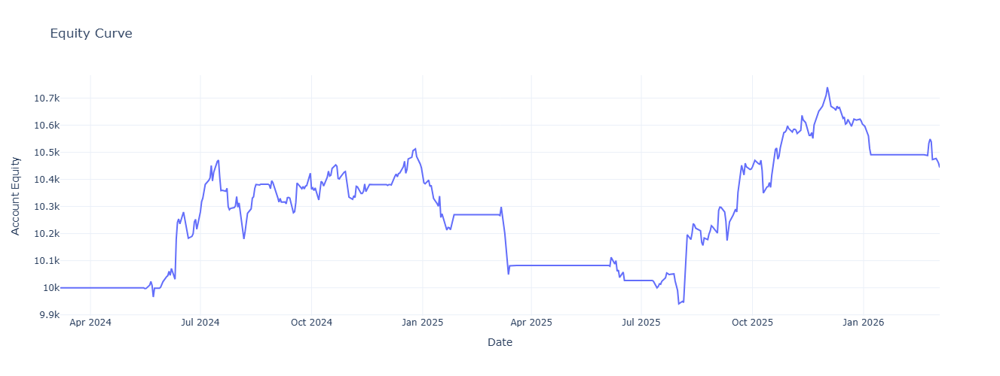

# simple-backtester

A lightweight, long-only backtesting engine for signal-based strategies.

It is designed for transparent trade simulation with fixed USD position sizing,
fees, slippage, and simple performance metrics — without depending on large
frameworks or paid libraries.


## Why

Most backtesting libraries do too much. This one does the minimum:
take entry/exit signals, simulate trades with fees and slippage, 
return equity curve and basic metrics.

## Install

```bash
pip install numpy polars bottleneck
```

Clone `backtester.py` into your project.

## Quick Example

```python
import numpy as np
from backtester import SimpleBacktester

close   = np.array([100, 102, 105, 103, 108, 110])
entries = np.array([True, False, False, False, True, False])
exits   = np.array([False, False, True, False, False, True])

bt = SimpleBacktester(
    close=close,
    entries=entries,
    exits=exits,
    fees=0.001,
    slippage=0.0005,
    size_usd=1000,
    init_cash=10000,
)

print(bt.summary())
```
Output:

|Metrics|	Value|
|---|---|
|"Start"|	10000.0|
|"End"	|10443.68|
|"win_rate[%]"|	33.33|
|"total_return[%]"|	4.44|
|"max_drawdown[%]"|	-5.44|
|"sharpe_per_period"|	0.037|
|"profit_factor"|	2.3814|
|"closed_trades"|	6.0|

`print(bt.trades)`
Output:
```
┌───────┬───────┬────────────┬───────────┬──────────┬──────────────┬──────────────┬──────────────┐
│ index ┆ type  ┆ price      ┆ pos_size  ┆ size_usd ┆ cash         ┆ equity       ┆ realized_pnl │
│ ---   ┆ ---   ┆ ---        ┆ ---       ┆ ---      ┆ ---          ┆ ---          ┆ ---          │
│ i64   ┆ str   ┆ f64        ┆ f64       ┆ f64      ┆ f64          ┆ f64          ┆ f64          │
╞═══════╪═══════╪════════════╪═══════════╪══════════╪══════════════╪══════════════╪══════════════╡
│ 49    ┆ entry ┆ 188.383026 ┆ 10.611362 ┆ 2000.0   ┆ 7998.0       ┆ 9997.0005    ┆ 0.0          │
│ 114   ┆ exit  ┆ 225.031784 ┆ 10.611362 ┆ 2000.0   ┆ 10382.313093 ┆ 10385.89374  ┆ 382.313093   │
│ 119   ┆ entry ┆ 226.541855 ┆ 8.823979  ┆ 2000.0   ┆ 8380.313093  ┆ 10379.313593 ┆ 0.0          │
│ 178   ┆ exit  ┆ 227.039734 ┆ 8.823979  ┆ 2000.0   ┆ 10380.702778 ┆ 10383.706867 ┆ -1.610315    │
│ 187   ┆ entry ┆ 241.331665 ┆ 8.283209  ┆ 2000.0   ┆ 8378.702778  ┆ 10377.703278 ┆ 0.0          │
│ …     ┆ …     ┆ …          ┆ …         ┆ …        ┆ …            ┆ …            ┆ …            │
│ 312   ┆ entry ┆ 200.021317 ┆ 9.993937  ┆ 2000.0   ┆ 8080.585208  ┆ 10079.585708 ┆ 0.0          │
│ 320   ┆ exit  ┆ 195.046448 ┆ 9.993937  ┆ 2000.0   ┆ 10026.944233 ┆ 10029.867181 ┆ -55.640975   │
│ 336   ┆ entry ┆ 210.519363 ┆ 9.495566  ┆ 2000.0   ┆ 8024.944233  ┆ 10023.944732 ┆ 0.0          │
│ 460   ┆ exit  ┆ 260.086609 ┆ 9.495566  ┆ 2000.0   ┆ 10490.910511 ┆ 10494.613781 ┆ 463.966279   │
│ 491   ┆ entry ┆ 266.179993 ┆ 7.509958  ┆ 2000.0   ┆ 8488.910511  ┆ 10487.911011 ┆ 0.0          │
└───────┴───────┴────────────┴───────────┴──────────┴──────────────┴──────────────┴──────────────┘
```

## Execution Rules

This engine follows a simple bar-by-bar execution model:

- Long-only
- One position at a time
- Signals are evaluated on each bar using the provided `close` price
- Entry fills use the current bar close with adverse slippage applied
- Exit fills use the current bar close with adverse slippage applied
- Fees are charged on both entry and exit
- Position size is fixed in USD (`size_usd`) for every trade
- No pyramiding or partial exits
- If already in a position, exit logic takes priority
- If flat, entry logic is evaluated and exit signals are ignored
- Open positions are marked to market each bar using the current close

## Inputs

`SimpleBacktester` expects three NumPy-compatible arrays of equal length:

- `close`: closing prices
- `entries`: boolean entry signals
- `exits`: boolean exit signals

Optional parameters:

- `fees`: proportional fee rate per trade side
- `slippage`: proportional adverse slippage applied on fills
- `size_usd`: fixed USD capital allocated to each trade
- `init_cash`: starting cash balance


## Outputs

After running the backtest, the object exposes:

- `bt.equity_array` — full equity curve as a NumPy array
- `bt.trades` — trade log as a Polars DataFrame
- `bt.returns` — per-period equity returns
- `bt.summary()` — table of core performance metrics


## Trade Log Columns

The trade log contains the following fields:

- `index` — bar index where the trade occurred
- `type` — `entry` or `exit`
- `price` — raw close price at that bar
- `pos_size` — quantity of asset held
- `size_usd` — USD notional used for the trade
- `cash` — cash balance after the event
- `equity` — equity recorded during that bar
- `realized_pnl` — realized PnL on exits

## Metrics
|Metric|	Description|
|---|---|
|Total Return %	|End equity vs starting cash|
|Max Drawdown %	|Largest peak-to-trough decline|
|Sharpe Ratio	|Mean return / std of returns (per period)|
|Win Rate %	|Winning trades / total closed trades|
|Profit Factor	|Gross profit / gross loss|

## Important Assumption

This backtester uses the same bar's close both to evaluate signals and simulate fills.
That makes it simple and transparent, but it may not match realistic execution for all strategies.

If your signals are generated from close data and can only be acted on after the bar closes,
you may want to shift entries/exits by one bar before passing them into the engine.

## Limitations
- Long-only — no short selling
- Close prices only — no high/low/open
- Fixed position size in USD — no percentage-based sizing
- Integer index — no datetime handling, map to your own dates
- No benchmark comparison
- Sharpe is per-period, not annualized — multiply by √(periods_per_year) yourself

## Tests

Current tests cover:
- cash accounting with fees and slippage
- profitable and losing trades
- insufficient cash handling
- repeated entry suppression
- same-bar signal behavior

multiple round-trip trades

Run unit tests with:

```bash
pytest tests/test_backtester.py -v
```

## Why Polars?

Polars is used for fast and convenient trade-log handling and summary formatting.
The core backtest loop itself is Numba-based. 
And honestly for the love of rust personally.

## Performance

The backtest engine was refactored from a pure Python loop to a Numba-compiled loop.
Benchmarking on identical precomputed inputs showed large speedups after JIT warm-up.

- 10,000 bars: ~100x faster
- 1,000,000 bars: ~44x faster
- 30,000,000 bars: ~52x faster

First-call timings include Numba compliation overhead and are not representative of repeated runs.
See [benchmarks/README.md](benchmarks/README.md) for benchmark methodology and raw results.

## Project Status

This is an early-stage utility focused on clarity over feature depth.

Current scope:
- single-asset
- long-only
- fixed USD position sizing
- close-based execution
- basic metrics

It is intended as a simple, inspectable foundation for custom research workflows.

## Roadmap

Planned improvements:

- datetime-aware trade indexing
- percentage-based sizing
- optional annualized metrics helpers
- benchmark comparison
- short-selling support
- cleaner package structure

## Example equity curve generated from the notebook workflow using `bt.equity_list`.
